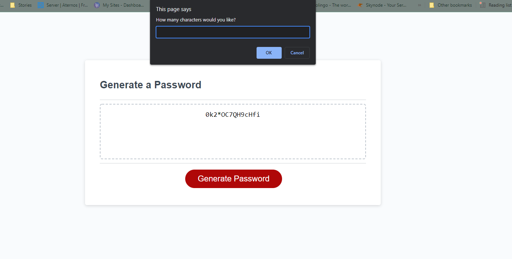

# Make-A-Secret

## This project was built with the intention of getting a better insight into javascript capabilities, particularly random generation and concatentation possibilities. 

>The point of this process was to really get a better understanding of how to contatenate within my arrays, and how to tie everything back in so values would be accounted for if needed. Initially, I wasn't sure how to get the actual password to print on the screen despite having all of the prompts for the password itself and all the alerts needed to identify the various parameters set by the user. 

>It was a struggle to identify at first that I had to *change the strings into numbers,* and then better identify how lengths were being used within the parameters. Initially, I also forgot to loop back around for the password length itself. The system would prompt for a number, and if that number were outside of the allowed length *(8-128)*, then it would return a message asking the user to correct the number to within range, but then it would move into the next question instead of looping back to reask for a length, so I had to *add another alert within my if-statement that would prompt the user to input a new number if the number selected was not within range.*

**This Project is able to generate a secure password that fits the needs of the user according to data inputted prior to generation**

## Solved: https://laurenagra.github.io/Make-A-Secret/
### Thank you!

